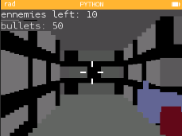
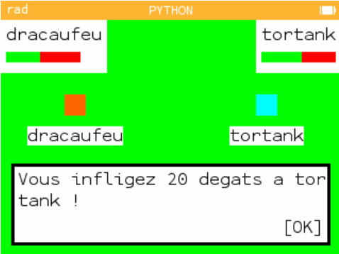
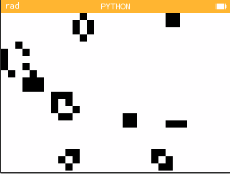
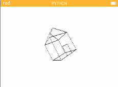
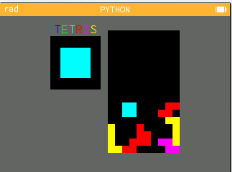
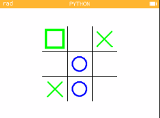
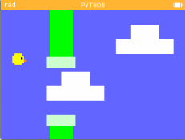
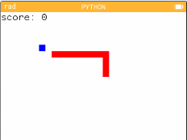
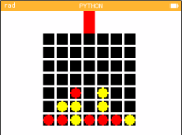

# CalculatorGames
a collection of games for the Numworks graphic calculator. Note that every file listed here is available on my [numworks profile](https://my.numworks.com/python/come-delfini-thibaudet)

## Bad Guys shooter
Bad guys shooter is a 3D First-Person-Shooter with animated ennemies. It uses a simple but powerful [raycasting](https://en.wikipedia.org/wiki/Ray_casting) algorithm to render
a simple scene at up to 6 frames per second. The gameplay is pretty simple, as the emphasis was put on the technical difficulties of getting the projection engine to work at
a reasonable speed.  It is important to note that every single one of the 500+ lines of code were written by hand, directly on the calculator's keyboard, along the course of
6 long months. It took me 3 tries and my sanity to get it right, but it's a pretty entertaining game now that it's done.  

## Pokemon
Pokemon Numworks Edition features a nice number of pokemons, mainly from the 5th generation, because after that new pokemons became lame.  
Because it contains duel mechanics as well as a 2D map to wander in, it stretches the limits of the calculator's memory.

## Game of life
This game is a simple implementation of Conway's [game of life](https://en.wikipedia.org/wiki/Conway%27s_Game_of_Life) that was made out of boredom. Not the most interesting
project in the bunch.  

## Wireframe
This script is another 3D experiment. It projects an array of points representing a lovely house and makes it spin. It flickers a lot on an actual calculator due to the unpractical line drawing, but achieves nice performances on the web emulator. It uses simple geometry to calculate the intersection of the projection plane with the ray going from each point to the center of the 3D space, and project what was calculated to the screen. I made the algorithm up from scratch so it would probably have been cleaner if I had coded it with my feet.  

## Tetris
What is there to say ? It's just yet another clone of the classical game, coded in just under 3 days. I'm pretty happy with it, so it finds its place here, but there's nothing more to say about it.  

## And more...
Here are some more games, for which I'm not going to write a detailed description:  
A game of tic-tac-toe:  
  
A flappy bird clone:  
  
A snake clone:  
  
A connect4:  
  
